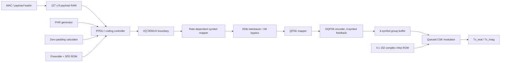
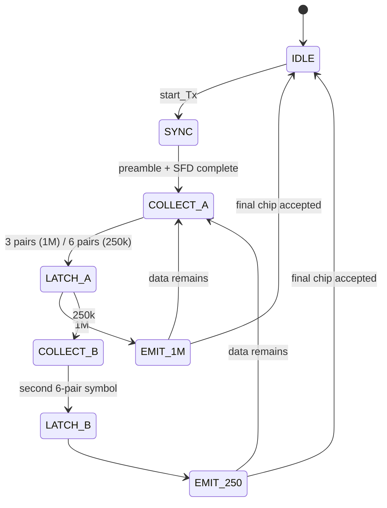

# RTL Architecture

## Datapath

The controller sequences zero padding, pair collection, symbol assembly, codeword mapping, 250-kbps interleaving, and PPDU emission. The mandatory `iq_demux` module is instantiated at the pair-to-I/Q boundary. The physical chirp waveform is stored rather than generated with runtime sine/cosine logic.

## Controller FSM

### Pairwise bit collection

The PHR+PSDU+padding stream is even-length. The controller obtains I and Q simultaneously as a bit pair: PHR first, then payload bits LSB-first within each byte, then zero padding. For 1 Mbps, three pairs build one 3-bit I symbol and one 3-bit Q symbol. For 250 kbps, two sets of six pairs build two 32-chip codewords per path and then the required 64-chip interleaving is performed.

## CSK queue and continuous waveform

`csk_modulator.sv` has a one-group look-ahead slot. While the current group emits samples, the next four DQPSK symbols can be queued. At the final sample of one group, the queued group is promoted without adding implementation-created holes.

`SAMPLE_DIV` defaults to 1. With a 32 MHz system clock this generates one output sample per clock. For a system clock that is an integer multiple of 32 MHz, set `SAMPLE_DIV = fclk/32MHz`.

## Data-rate selection

The assignment does not define a data-rate input, so the required external interface is preserved using a top-level elaboration parameter:

- `DATA_RATE=0`: 1 Mbps
- `DATA_RATE=1`: 250 kbps
